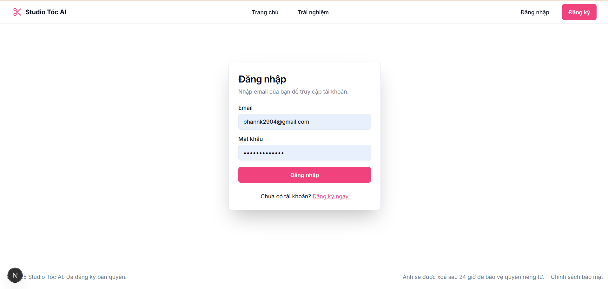
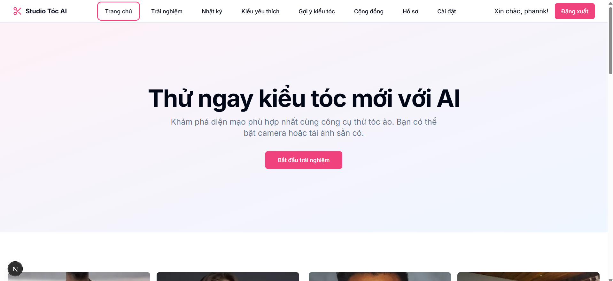
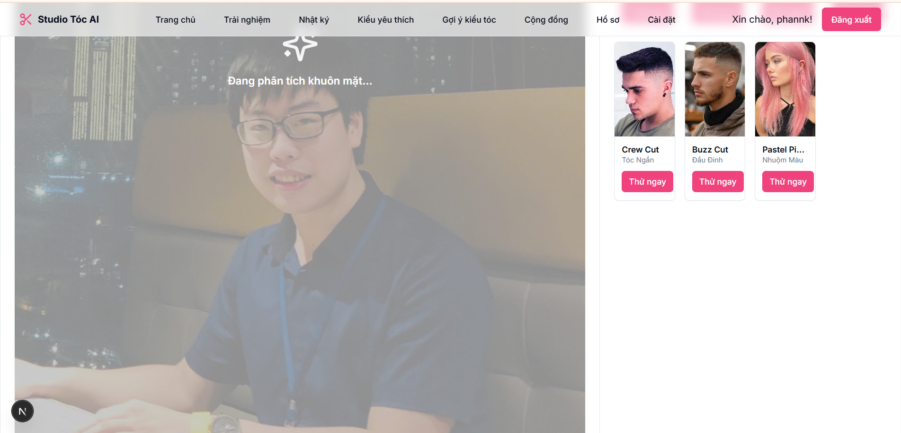
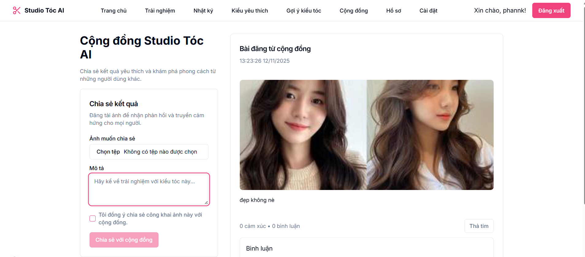
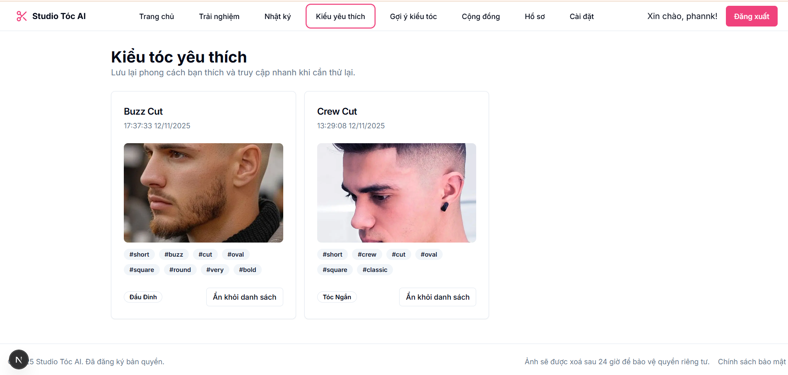
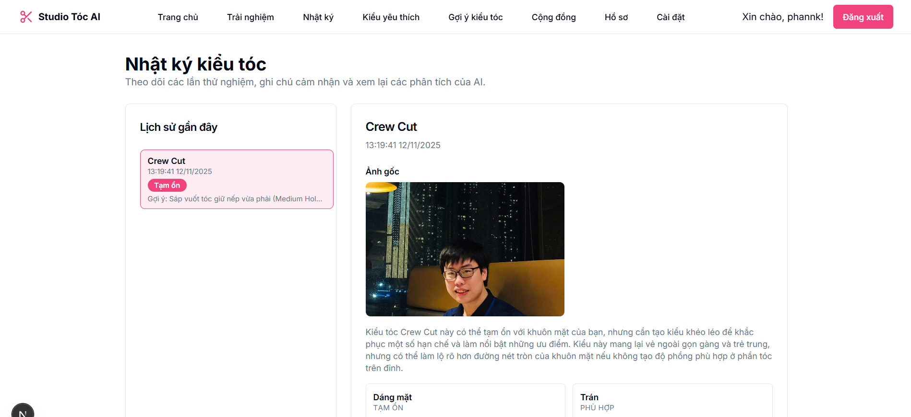
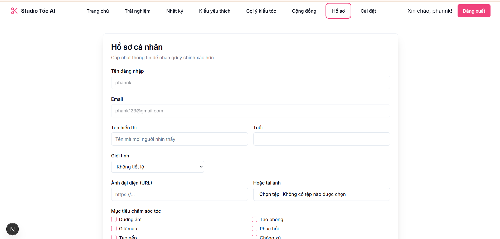

<h2 align="center">
        <a href="https://github.com/Nemmer772004/Ai-Hairstyle-NPA">
        🎓 Ai-Hairstyle-TPA — Next.js + AI
        </a>
</h2>
<h2 align="center">
     Ứng dụng AI trong nhận diện khuôn mặt và tư vấn kiểu tóc cá nhân hóa
</h2>
<div align="center">
   
   
   
</div>
<div align="center">

[](https://nextjs.org)
[](https://www.typescriptlang.org/)
[](https://tailwindcss.com)

</div>

## 📖 **1. Giới thiệu hệ thống**  
Ứng dụng **Ai-Hairstyle-TPA** là một web app hiện đại xây dựng bằng **Next.js (TypeScript)** với cơ sở dữ liệu tùy chọn **MongoDB (Mongoose)**, tích hợp các flow **AI (Genkit)** để phân tích khuôn mặt từ ảnh người dùng, gợi ý kiểu tóc phù hợp.

- Web-based: Truy cập qua trình duyệt
- Multi-user: Đăng ký/đăng nhập, hồ sơ cá nhân, lịch sử
- Real-time UX: UI mượt mà với React/Tailwind, thông báo toast
- Responsive: Giao diện thân thiện, tương thích mọi thiết bị

## ✨ **Tính năng chính**

### 🔐 **Xác thực & Tài khoản**
- Đăng ký/Đăng nhập người dùng, đổi thông tin hồ sơ
- Mã hóa mật khẩu với bcryptjs
- Quản lý session phía server (Next.js server actions)

### 🧠 **Phân tích & Gợi ý kiểu tóc (AI)**
- Phân tích khuôn mặt từ ảnh người dùng (flow: `src/ai/flows/analyze-face-and-suggest-hairstyles.ts`)
- Gợi ý danh sách kiểu tóc theo khuôn mặt (oval/round/square/…)

### 🖼️ **Xử lý ảnh**
- Upload ảnh khuôn mặt, resize/optimize (sharp)
- Tiền xử lý base64/Buffer an toàn

### 🌐 **Cộng đồng & Chia sẻ**
- Đăng bài chia sẻ kiểu tóc đã thử
- Bình luận, thả cảm xúc, theo dõi hoạt động

### ⭐ **Yêu thích & Lịch sử**
- Lưu các kiểu tóc yêu thích
- Xem lại lịch sử gợi ý

### 👤 **Hồ sơ & Cài đặt**
- Cập nhật avatar, thông tin cơ bản
- Tùy chọn hiển thị, nhận thông báo

---

## 🔧 **2. Công nghệ sử dụng**  

<p align="center">
    <a href="https://nextjs.org/">
        
    </a>
    <a href="https://www.typescriptlang.org/">
        
    </a>
    <a href="https://www.mongodb.com/">
        
    </a>
    <a href="https://tailwindcss.com/">
        
    </a>
    <a href="https://radix-ui.com/">
        
    </a>
</p>

### **Backend**
- ⚙️ **Next.js (server actions)**: Xử lý logic server-side, API routes
- 🗄️ **Mongoose**: Kết nối và thao tác MongoDB
- 🔐 **bcryptjs**: Hash mật khẩu
- 🔑 **dotenv**: Quản lý biến môi trường
- 🖼️ **sharp**: Xử lý ảnh
- 🤖 **Genkit**: Tích hợp flows AI (google-genai)

### **Frontend**
- ⚛️ **React 18 + Next.js App Router**
- 🎨 **Tailwind CSS**, **tailwind-merge**, **tailwindcss-animate**
- 🧩 **Radix UI**, **shadcn/ui**-style components (trong `src/components/ui`)
- 🖍️ **Lucide-react** icons, **Recharts** (chart), **Embla** (carousel)
- ✅ **React Hook Form** + **Zod** (form & validation)

### **Thư viện JavaScript chính**
```text
next@15.3.3
react@18.3.1
react-dom@18.3.1
typescript@^5
tailwindcss@^3.4.1
mongoose@^8.19.1
sharp@^0.33.5
zod@^3.24.2
react-hook-form@^7.54.2
@genkit-ai/google-genai@^1.20.0
genkit@^1.20.0
dotenv@^16.5.0
bcryptjs@^3.0.2
```

---

## 🖼️ **3. Giao diện hệ thống**  

### **3.1. Trang Đăng nhập**
<p align="center">
    
    <br>
    <em>Đăng nhập/Đăng ký người dùng với validation</em>
    </p>

### **3.2. Dashboard - Trang chủ**
<p align="center">
    
    <br>
    <em>Thống kê hoạt động, gợi ý gần đây, ảnh nổi bật</em>
</p>

### **3.3. Trình tạo kiểu tóc (Generator)**
<p align="center">
    
    <br>
    <em>Tải ảnh khuôn mặt, chọn tham số, chạy flow AI để gợi ý</em>
</p>

### **3.4. Cộng đồng (Community)**
<p align="center">
    
    <br>
    <em>Xem/chia sẻ bài đăng kiểu tóc, bình luận và tương tác</em>
</p>

### **3.5. Yêu thích (Favorites)**
<p align="center">
    
    <br>
    <em>Lưu và quản lý các kiểu tóc bạn thích</em>
</p>

### **3.6. Lịch sử (History)**
<p align="center">
    
    <br>
    <em>Xem lại các lần gợi ý</em>
</p>

### **3.7. Hồ sơ cá nhân (Profile)**
<p align="center">
    
    <br>
    <em>Cập nhật avatar, thông tin cơ bản và tuỳ chọn</em>
</p>

---

## ⚙️ **4. Cài đặt & Chạy ứng dụng**

### 📋 **4.1. Yêu cầu hệ thống**

- 🟢 **Node.js**: v18 trở lên (LTS)
- 💻 **Hệ điều hành**: Windows, macOS, hoặc Linux
- 🧰 **Trình quản lý gói**: npm
- 🗄️ **MongoDB**: tuỳ chọn (nếu muốn lưu dữ liệu)

### 📥 **4.2. Các bước cài đặt**

#### **🧰 Bước 1: Chuẩn bị môi trường**

Kiểm tra Node.js và npm:
```powershell
node -v
npm -v
```

Clone dự án:
```powershell
git clone https://github.com/Nemmer772004/Ai-Hairstyle-NPA.git
cd Ai-Hairstyle-NPA
```

#### **🔧 Bước 2: Cài dependencies**

```powershell
npm ci --ignore-scripts
```

#### **🗝️ Bước 3: Tạo file môi trường**

```powershell
notepad .env.local
```

Ví dụ nội dung:
```text
MONGODB_URI=mongodb://localhost:27017/ai-hairstyle-pa
GEMINI_API_KEY=your_gemini_api_key_here
PORT=9003
```

#### **🗄️ Bước 4: Kiểm tra kết nối MongoDB (tuỳ chọn)**

```powershell
node scripts/check-db.js
```

#### **▶️ Bước 5: Chạy ứng dụng**

```powershell
npm run dev
```

Hoặc sử dụng script hỗ trợ (có thể chạy npm install nếu thiếu):
```powershell
./start.ps1
```

Server dev mặc định tại: `http://localhost:9003`

---

## 👤 **5. Tài khoản đăng nhập mặc định**

Ứng dụng không cung cấp tài khoản mặc định. Hãy đăng ký tài khoản mới trong trang Đăng ký.

### **🎯 Hướng dẫn sử dụng**

**Người dùng mới:**
1. Đăng ký tài khoản và đăng nhập
2. Vào trang Generator, tải ảnh khuôn mặt và chọn tham số
3. Nhận gợi ý và lưu vào Yêu thích nếu muốn

**Người dùng đã đăng ký:**
1. Xem lịch sử, quản lý yêu thích
2. Chia sẻ bài viết lên Cộng đồng, bình luận/tương tác
3. Cập nhật avatar và thông tin hồ sơ

**Quản trị viên (nếu bật):**
1. Quản lý người dùng, nội dung cộng đồng
2. Theo dõi hoạt động và thống kê cơ bản

---

## 🗂️ **6. Cấu trúc thư mục dự án**

```
Ai-Hairstyle-NPA/
├── apphosting.yaml
├── components.json
├── next-env.d.ts
├── next.config.ts
├── package.json
├── postcss.config.mjs
├── README.md
├── start.ps1
├── start.sh
├── tailwind.config.ts
├── tsconfig.json
├── acsess/
│   └── images/
├── docs/
│   └── blueprint.md
├── scripts/
│   └── check-db.js
└── src/
        ├── ai/
        │   ├── dev.ts
        │   ├── genkit.ts
        │   └── flows/
        │       ├── analyze-face-and-suggest-hairstyles.ts
        │       └── generate-hairstyle-image.ts
        ├── app/
        │   ├── actions.ts
        │   ├── globals.css
        │   ├── layout.tsx
        │   ├── page.tsx
        │   ├── api/
        │   │   ├── history/
        │   │   └── maintenance/
        │   ├── auth/
        │   ├── community/
        │   ├── favorites/
        │   ├── generator/
        │   ├── history/
        │   ├── login/
        │   ├── privacy/
        │   ├── profile/
        │   ├── recommendations/
        │   ├── register/
        │   └── settings/
        ├── components/
        │   ├── auth-buttons.tsx
        │   ├── footer.tsx
        │   ├── header.tsx
        │   └── ui/ ...
        ├── hooks/
        ├── lib/
        ├── models/
        └── types/
```

---

## 📚 **7. Quản lý Database**

### **CLI/Script**

```powershell
# Kiểm tra kết nối MongoDB (sử dụng MONGODB_URI từ .env.local)
node scripts/check-db.js
```

### **Lưu ý**
- Dự án không cung cấp lệnh migrate/seed mặc định. Bạn có thể tạo dữ liệu thông qua UI hoặc thêm script seed riêng.

---

## 🎨 **Giao diện**
- Thiết kế hiện đại với Tailwind CSS + Radix UI
- Responsive cho mobile/tablet/desktop
- Icons với Lucide-react, animations cơ bản
- Toast notifications, modal dialogs

---

## 🚀 **8. Tính năng nổi bật**

### ⚡ **AI Flows**
- Phân tích khuôn mặt và gợi ý kiểu tóc theo shape
- Chọn kiểu tóc và phân tích độ phù hợp

### 📊 **Dashboard & Lịch sử**
- Theo dõi lịch sử gợi ý/sinh ảnh
- Thống kê cơ bản (có thể mở rộng)

### 🔍 **Tìm kiếm & Cộng đồng**
- Tìm kiếm bài/kiểu tóc
- Chia sẻ và tương tác trong cộng đồng

---

## 🐛 **9. Troubleshooting**

**1. Node version không phù hợp**
```powershell
node -v  # đảm bảo >= 18
```

**2. Lỗi cài đặt sharp trên Windows**
```powershell
# Cài lại dependencies, đảm bảo có build tools
npm ci --ignore-scripts
```

**3. Không kết nối được MongoDB**
```powershell
node scripts/check-db.js
# Kiểm tra MONGODB_URI và dịch vụ MongoDB đang chạy
```

**4. Cổng 9003 đã được sử dụng**
```powershell
netstat -ano | findstr :9003
taskkill /PID <PID> /F
```

**5. Thiếu biến môi trường**
- Tạo `.env.local` và điền `GEMINI_API_KEY`, `MONGODB_URI` (nếu dùng)

---

## 📈 **10. Kế hoạch phát triển**

### **Phase 1 (Completed ✅)**
- ✅ Luồng gợi ý/sinh ảnh cơ bản
- ✅ Auth, hồ sơ, lịch sử, yêu thích
- ✅ Cộng đồng: bài viết, bình luận cơ bản

### **Phase 2 (Future)**
- 📱 PWA/ứng dụng mobile
- ☁️ Lưu trữ ảnh trên cloud (S3/GCS)
- 🧵 Queue/background jobs cho xử lý ảnh nặng
- 🔔 Real-time notifications
- 🧪 E2E tests & CI/CD

---

## 🤝 **11. Đóng góp (Contributing)**

Chúng tôi hoan nghênh mọi đóng góp cho dự án!

### **Cách đóng góp:**

1. Fork repository
2. Tạo branch mới (`git checkout -b feature/AmazingFeature`)
3. Commit changes (`git commit -m 'Add some AmazingFeature'`)
4. Push to branch (`git push origin feature/AmazingFeature`)
5. Tạo Pull Request

### **Coding Standards:**
- TypeScript + ESLint/Prettier (tuỳ chọn thiết lập)
- Tên biến/hàm có ý nghĩa, tách nhỏ component hợp lý
- Viết test cho tính năng quan trọng
- Cập nhật README nếu cần

---

## 📜 **12. License**

Dự án được phát triển cho mục đích học tập/demo. Vui lòng thêm License (MIT/GPL/…) nếu bạn muốn phát hành công khai.

---


Nếu bạn muốn thêm thông tin nhóm, website, fanpage, hoặc email liên hệ, hãy cung cấp và tôi sẽ cập nhật.

---

<div align="center">

### ⭐ Nếu bạn thấy dự án hữu ích, hãy cho một Star nhé! ⭐

**Made with ❤️ for AI hairstyle exploration**

</div>

Tôi là Trần Phương Anh CNTT 16-05
